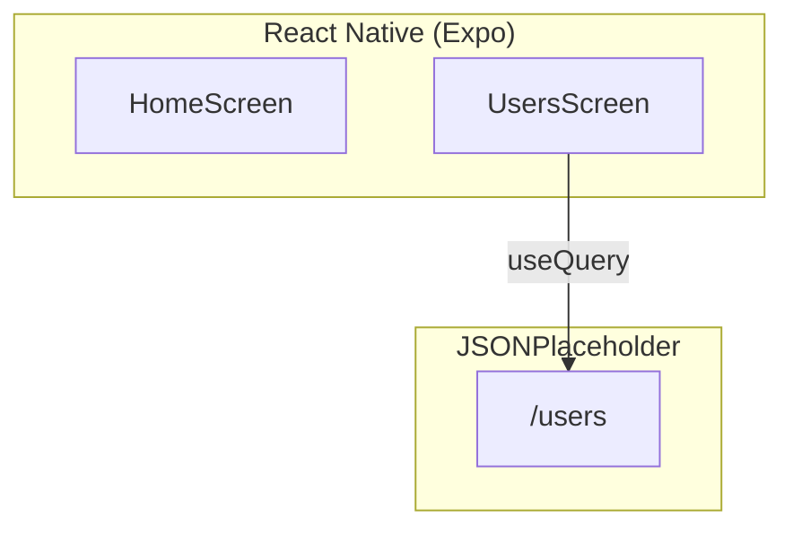

# 🎯 CP5 2025 — 2º Semestre — **TanQuery** (2TDSPZ)


---

## 👥 Integrantes
- **Amanda Mesquita Cirino Da Silva — RM559177**  
- **Journey Tiago Lopes Ferreira — RM556071**  
- **Paulo André Carminati — RM557881**  

**Professor:** Fernando Pinéo  
**Curso:** TDS (2TDSPZ)  
**Disciplina:** Mobile Application Development  

**Repositório:** [GitHub - CP5 Mobile](https://github.com/carmipa/mobile_aplication_development_CP_2SEM/tree/main/cp5)

---

## 🧭 Índice

1. [Sobre o Projeto](#-sobre-o-projeto)  
2. [Descrição do Funcionamento](#-descrição-do-funcionamento)  
3. [Arquitetura do Projeto](#-arquitetura-do-projeto)  
4. [Estrutura de Pastas](#-estrutura-de-pastas)  
5. [Funcionalidades](#-funcionalidades)  
6. [Critérios de Avaliação](#-critérios-de-avaliação)  
7. [Instalação e Execução](#-instalação-e-execução)  
8. [Licença](#-licença)  

---

## 📖 Sobre o Projeto

Este projeto corresponde ao **Checkpoint 4 (CP4)** de Mobile Application Development.  
O objetivo é **consumir dados de uma API pública no React Native utilizando o TanStack Query**.  

O app foi desenvolvido em trio, em **React Native (Expo)** com **TypeScript**. Ele exibe uma lista de **usuários** obtidos da API **JSONPlaceholder**, mostrando **nome, email e cidade**. Também implementa tratamento de **carregamento** e **erro**.

---

## 🔎 Descrição do Funcionamento

### 🔁 Fluxo do Aplicativo

1. O app inicializa dentro do `QueryClientProvider` (TanStack Query).  
2. A tela `UsersScreen` dispara a query `useQuery` → `GET /users`.  
3. Durante a requisição:
   - Mostra `"Carregando usuários..."`.  
4. Caso haja erro:
   - Mostra `"Erro ao carregar usuários"`.  
5. Se a chamada for bem-sucedida:
   - Exibe a lista formatada com:
     - 👤 **Nome**
     - ✉️ **Email**
     - 🏙️ **Cidade**  

### 👨‍💻 Interação do Usuário
- O usuário abre o app.  
- Automaticamente a lista de usuários é carregada da API.  
- Ele visualiza os dados em tela com feedback visual (loading ou erro).  

---

## 🏗 Arquitetura do Projeto



---

## 📂 Estrutura de Pastas

```bash
src/
 ├─ screens/
 │   └─ UsersScreen.tsx      # Tela que consome a API
 ├─ services/
 │   └─ api.ts               # Configuração do fetch/axios
 ├─ App.tsx                  # Ponto de entrada com QueryClientProvider
 └─ README.md                # Documentação do projeto
```

---

## ✨ Funcionalidades

### ✅ Obrigatórias
- Configurar **TanStack Query** (QueryClient + Provider).  
- Consumir a API JSONPlaceholder via `useQuery`.  
- Exibir **nome, email e cidade** dos usuários.  
- Mostrar mensagens de **carregamento** e **erro**.  

### ➕ Opcionais (Extras)
- Botão **Refetch** (atualizar lista).  
- **Paginação fake** (simular troca de páginas).  
- Navegação entre telas.  

---

## 📊 Critérios de Avaliação

| Critério                                            | Pontos |
| --------------------------------------------------- | ------ |
| TanStack Query corretamente instalado e configurado | 2      |
| Hook `useQuery` utilizado corretamente              | 2      |
| Exibição dos dados na interface                     | 3      |
| Tratamento de loading e erro                        | 2      |
| Organização e legibilidade do código                | 1      |
| **Total**                                           | **10** |

---

## ⚙️ Instalação e Execução

### 🔽 Instalação
```bash
# Clonar o repositório
git clone https://github.com/carmipa/mobile_aplication_development_CP_2SEM.git
cd cp4-TanQuery

# Instalar dependências
npm install

# Instalar TanStack Query
npm i @tanstack/react-query
```

### ▶️ Execução
```bash
expo start -c
```

**Atalhos Expo:**  
- `a` → Android  
- `i` → iOS  
- `w` → Web  
- `r` → reload  

---

## 📜 Licença
Este projeto está sob a licença **MIT**.  
Uso livre para fins acadêmicos e aprendizado.
