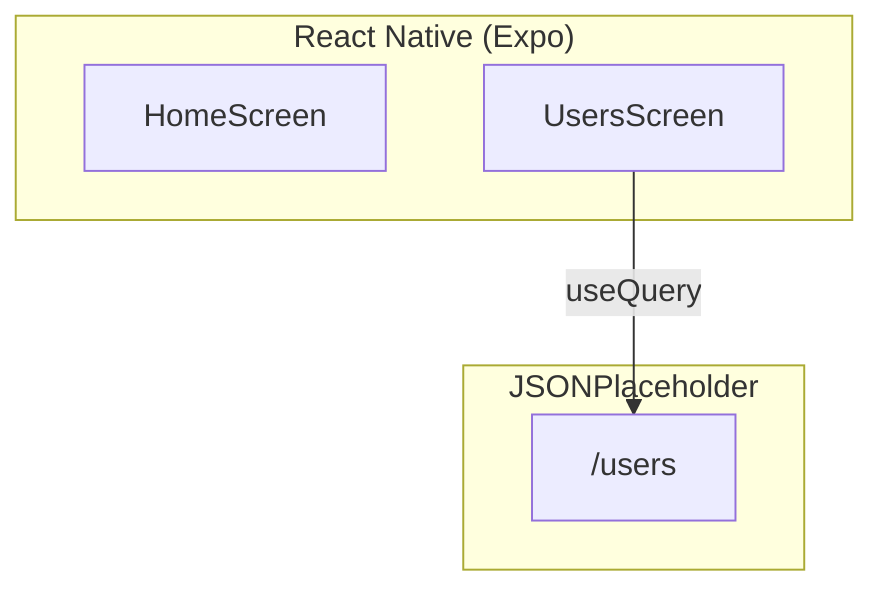

# 🎯 CP4 2025 — 2º Semestre — **TanQuery** (2TDSPZ)


---

## 👥 Integrantes
- **Amanda Mesquita Cirino Da Silva — RM559177**  
- **Journey Tiago Lopes Ferreira — RM556071**  
- **Paulo André Carminati — RM557881**  

**Professor:** Fernando Pinéo — **Curso:** TDS — **Turma:** 2TDSPZ  
**Repositório:** https://github.com/carmipa/mobile_aplication_development_CP_2SEM/tree/main/cp4-TanQuery

---

## 📖 Descrição
Projeto do **CP4**: consumir dados de uma **API pública** no **React Native (Expo)** usando **TanStack Query**, exibindo lista de usuários e tratando **loading** e **erro**.

---

## 🏗 Arquitetura do Projeto

> **Dica GitHub/Mermaid:** evite emojis em identificadores e sempre use **aspas** nos rótulos.  
> O bloco abaixo foi ajustado para renderizar corretamente no GitHub.


### Fluxo
1. O app sobe com `QueryClientProvider`.  
2. `UsersScreen` executa `useQuery` → `GET /users`.  
3. Exibe **Carregando...**, trata **Erro**, e lista **nome, email e cidade**.

---

## ✨ Requisitos (PDF)
- Configurar **TanStack Query** (QueryClient/Provider).
- Usar `useQuery` para buscar a API.
- Exibir **nome**, **email** e **cidade**.
- Mensagens: **“Carregando usuários...”** e **“Erro ao carregar usuários”**.
- **API:** https://jsonplaceholder.typicode.com/users

### Pontuação (10 pts)
| Critério                                            | Pontos |
|-----------------------------------------------------|--------|
| TanStack Query corretamente instalado e configurado | 2      |
| `useQuery` utilizado corretamente                   | 2      |
| Exibição dos dados                                  | 3      |
| Loading e erro                                      | 2      |
| Organização e legibilidade                          | 1      |
| **Total**                                           | **10** |

---

## 📂 Estrutura sugerida
```
src/
 ├─ screens/
 │   └─ UsersScreen.tsx
 ├─ App.tsx
 └─ services/
     └─ api.ts
```

---

## ⚙️ Instalação
```bash
npm install
npm i @tanstack/react-query
expo start -c
```

**Atalhos Expo:** `a` Android, `i` iOS, `w` Web, `r` reload.

---

## 📜 Licença
MIT
