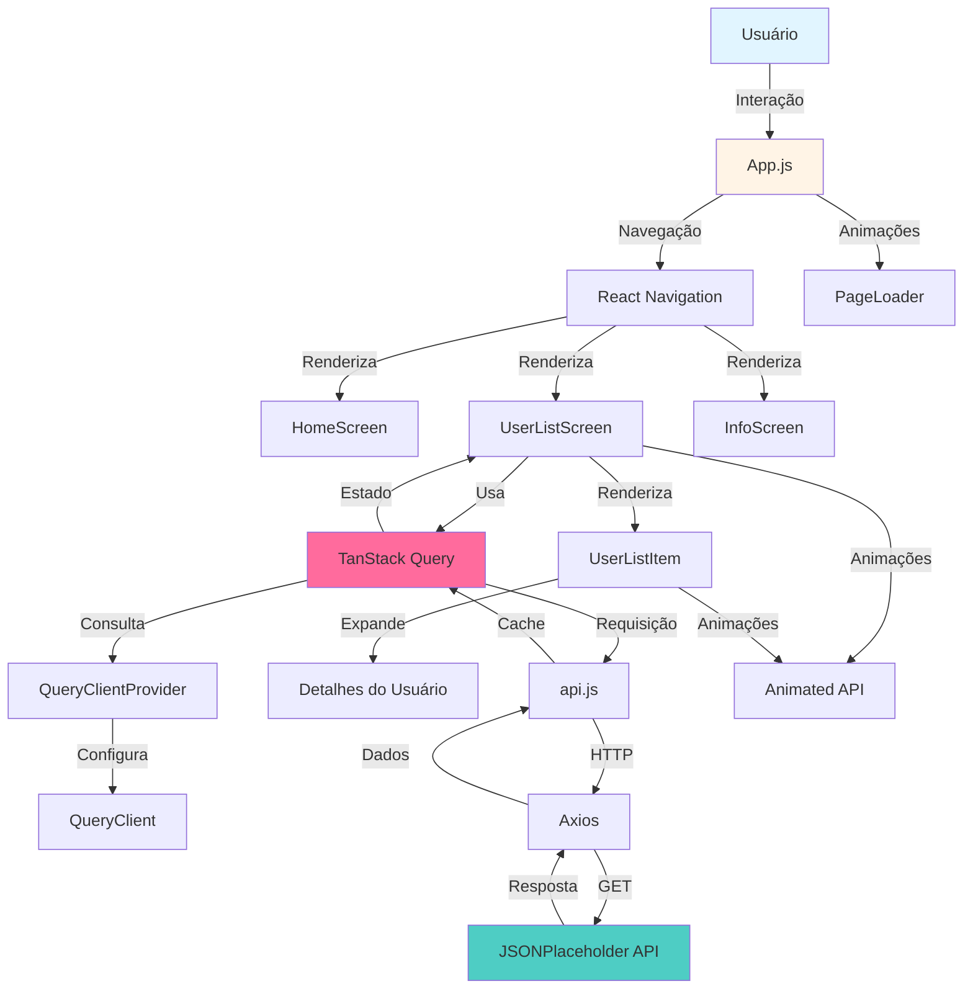
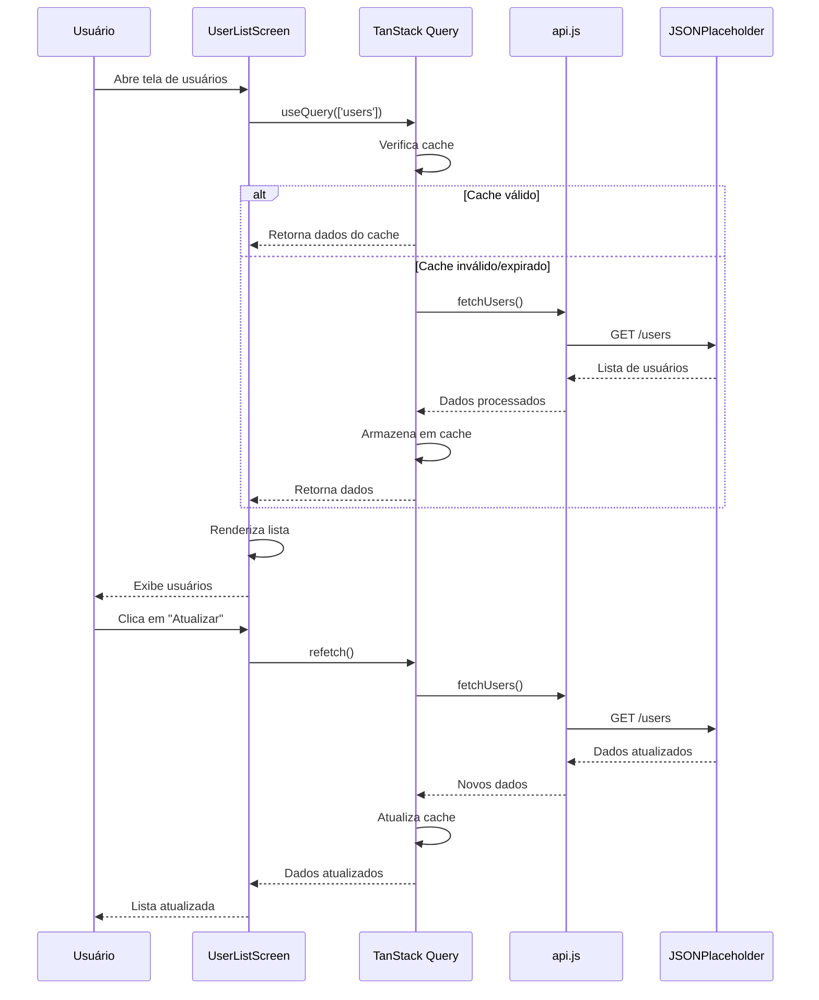
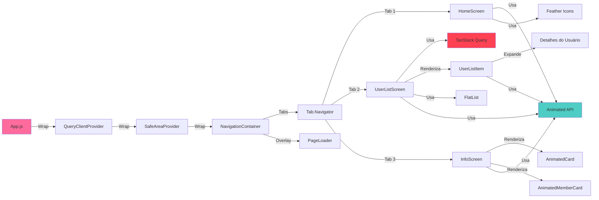
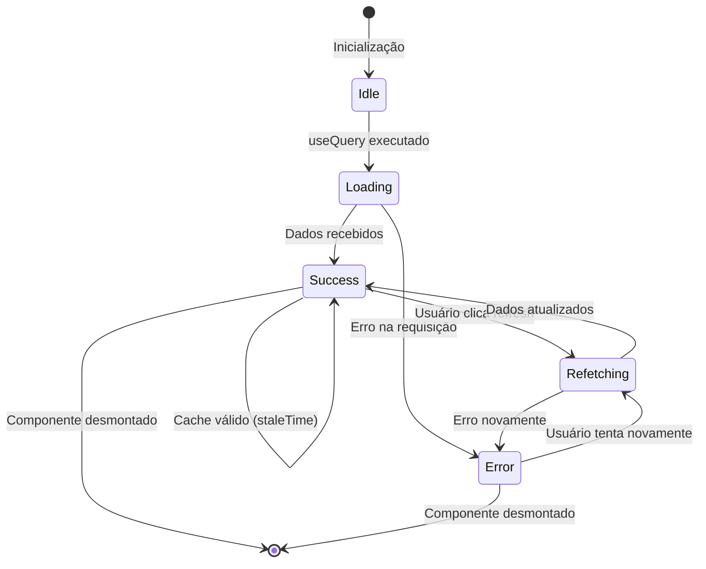

# 📱 CP4 - TanStack Query | React Native Mobile App

<div align="center">


[](https://opensource.org/licenses/MIT)
[](https://github.com/carmipa/mobile_aplication_development_CP_2SEM)

**Aplicativo mobile desenvolvido em React Native com Expo para consumo de API REST utilizando TanStack Query**

</div>

---

## 📑 Índice de Navegação

- [📱 Sobre o Projeto](#-sobre-o-projeto)
- [🎯 Objetivos](#-objetivos)
- [✨ Funcionalidades](#-funcionalidades)
- [🛠️ Tecnologias Utilizadas](#️-tecnologias-utilizadas)
- [📁 Estrutura do Projeto](#-estrutura-do-projeto)
- [🏗️ Arquitetura do Sistema](#️-arquitetura-do-sistema)
- [🚀 Como Executar](#-como-executar)
- [📱 Telas do Aplicativo](#-telas-do-aplicativo)
- [🎨 Animações e Transições](#-animações-e-transições)
- [👥 Equipe de Desenvolvimento](#-equipe-de-desenvolvimento)
- [📊 Critérios de Avaliação](#-critérios-de-avaliação)
- [📚 Documentação Técnica](#-documentação-técnica)
- [🔧 Configuração e Instalação](#-configuração-e-instalação)
- [📝 Scripts Disponíveis](#-scripts-disponíveis)
- [🐛 Troubleshooting](#-troubleshooting)
- [📄 Licença](#-licença)

---

## 📱 Sobre o Projeto

Este projeto é um **aplicativo mobile** desenvolvido como parte do **CP4 (Checkpoint 4)** da disciplina de **Mobile Application Development** do curso de **Tecnologia em Desenvolvimento de Sistemas** da **FIAP**.

O aplicativo demonstra o consumo de uma API REST pública ([JSONPlaceholder](https://jsonplaceholder.typicode.com)) utilizando **TanStack Query** (anteriormente React Query) para gerenciamento eficiente de estado assíncrono, cache e sincronização de dados.

### 📋 Informações do Projeto

| Campo | Valor |
|-------|-------|
| **Curso** | Tecnologia em Desenvolvimento de Sistemas |
| **Turma** | 2-TDSPZ - 2º Semestre - FIAP-2025 |
| **Professor** | Fernando Pinéo de Abreu |
| **Disciplina** | Mobile Application Development |
| **Data de Entrega** | 14 de agosto de 2025 |
| **Peso** | 1,5 pontos (CP4) |

---

## 🎯 Objetivos

### Objetivos Principais

- ✅ Implementar consumo de API REST em React Native
- ✅ Configurar e utilizar TanStack Query para gerenciamento de estado assíncrono
- ✅ Implementar tratamento de estados de loading, erro e sucesso
- ✅ Criar interface responsiva e intuitiva
- ✅ Implementar navegação entre telas
- ✅ Adicionar animações e transições suaves
- ✅ Implementar paginação de dados
- ✅ Adicionar funcionalidade de refetch manual

### Objetivos de Aprendizado

- Compreender o funcionamento do TanStack Query
- Aplicar boas práticas de desenvolvimento mobile
- Implementar UX/UI moderna com animações
- Gerenciar estados assíncronos de forma eficiente

---

## ✨ Funcionalidades

### 🎨 Funcionalidades Principais

- 📋 **Listagem de Usuários**: Exibe lista paginada de usuários da API
- 🔄 **Atualização Manual**: Botão para recarregar dados da API
- 📄 **Paginação**: Navegação entre páginas de usuários (5 por página)
- 🔍 **Detalhes Expandíveis**: Cards expansíveis com informações completas
- 🏠 **Tela Inicial**: Apresentação do projeto e informações acadêmicas
- ℹ️ **Sobre**: Informações da equipe e repositório
- 🎭 **Animações**: Transições suaves entre telas e elementos
- ⚡ **Loading States**: Indicadores visuais durante carregamento
- 🚨 **Error Handling**: Tratamento e exibição de erros

### 🎯 Funcionalidades Avançadas

- ✨ **Animações de Hover**: Efeitos visuais nos cards ao toque
- 🔄 **Transições de Tela**: Animações ao mudar entre abas
- 📱 **Responsividade**: Adaptação para diferentes tamanhos de tela
- 🎨 **Design Moderno**: Interface limpa e profissional
- 🚀 **Performance**: Otimização com cache e lazy loading

---

## 🛠️ Tecnologias Utilizadas

### 📦 Dependências Principais

| Tecnologia | Versão | Descrição |
|------------|--------|-----------|
| **React Native** | `0.79.6` | Framework para desenvolvimento mobile multiplataforma |
| **Expo** | `~53.0.23` | Plataforma e ferramentas para React Native |
| **React** | `^19.0.0` | Biblioteca JavaScript para construção de interfaces |
| **TanStack Query** | `^5.85.0` | Biblioteca para gerenciamento de estado assíncrono e cache |
| **React Navigation** | `^7.4.6` | Biblioteca de navegação para React Native |
| **Axios** | `^1.11.0` | Cliente HTTP para requisições à API |
| **React Native Gesture Handler** | `~2.24.0` | Sistema de gestos nativo para React Native |
| **React Native Safe Area Context** | `5.4.0` | Gerenciamento de áreas seguras da tela |
| **React Native Screens** | `~4.11.1` | Componentes de tela nativos otimizados |

### 🎨 Bibliotecas de UI e Ícones

| Tecnologia | Versão | Descrição |
|------------|--------|-----------|
| **@expo/vector-icons** | `^14.1.0` | Conjunto de ícones para Expo |
| **Expo Status Bar** | `~2.2.3` | Componente para controlar a barra de status |

### 🔧 Ferramentas de Desenvolvimento

| Tecnologia | Versão | Descrição |
|------------|--------|-----------|
| **Babel Core** | `^7.20.0` | Compilador JavaScript |
| **Metro Bundler** | `~5.0.5` | Bundler para React Native |

### 🌐 APIs e Serviços Externos

- **JSONPlaceholder**: API REST pública para testes
  - Endpoint: `https://jsonplaceholder.typicode.com/users`
- **UI Avatars**: Geração de avatares dinâmicos
  - URL: `https://ui-avatars.com/api/`

---

## 📁 Estrutura do Projeto

```
cp6-TanQuery-final-semestre/
│
├── 📱 android/                          # Configurações Android nativas
│   ├── app/
│   │   ├── build.gradle                 # Configuração de build Android
│   │   ├── src/
│   │   │   ├── main/
│   │   │   │   ├── AndroidManifest.xml  # Manifest Android
│   │   │   │   ├── java/                # Código Kotlin/Java nativo
│   │   │   │   └── res/                 # Recursos Android (ícones, splash)
│   │   │   └── debug/
│   │   └── proguard-rules.pro          # Regras ProGuard
│   ├── build.gradle                     # Build principal Android
│   ├── gradle/                          # Wrapper Gradle
│   └── settings.gradle                 # Configurações Gradle
│
├── 🎨 assets/                          # Recursos estáticos
│   ├── fotos/                          # Fotos da equipe
│   │   ├── amanda.png
│   │   ├── gabi.png
│   │   ├── journey.png
│   │   ├── paulo.png
│   │   └── android.png                 # Logo Android
│   ├── icon.png                        # Ícone do app
│   ├── splash-icon.png                # Splash screen
│   └── adaptive-icon.png              # Ícone adaptativo
│
├── 📂 src/                             # Código-fonte principal
│   ├── 🏠 HomeScreen.js                # Tela inicial do app
│   ├── 👥 UserListScreen.js           # Tela de listagem de usuários
│   ├── 📋 UserListItem.js              # Componente de item da lista
│   ├── ℹ️ InfoScreen.js                # Tela sobre o projeto
│   ├── 🔄 PageLoader.js                # Componente de loading
│   ├── 🌐 api.js                       # Configuração e funções da API
│   ├── ⚙️ QueryClientProvider.js       # Provider do TanStack Query
│   └── 📺 DisplayScreen.js             # Tela de exibição (reserva)
│
├── 📄 App.js                           # Componente raiz da aplicação
├── 📄 index.js                         # Ponto de entrada da aplicação
├── 📄 babel.config.js                  # Configuração Babel
├── 📄 app.json                         # Configuração Expo
├── 📄 package.json                     # Dependências e scripts
└── 📄 README.md                        # Documentação do projeto
```

### 📂 Descrição Detalhada dos Arquivos

#### 🎯 Arquivos Principais

- **`App.js`**: Componente raiz que configura a navegação por abas e gerencia transições
- **`index.js`**: Ponto de entrada que registra o componente principal
- **`babel.config.js`**: Configuração do Babel para transpilação

#### 📱 Telas (Screens)

- **`HomeScreen.js`**: Tela inicial com informações do projeto, curso e equipe
- **`UserListScreen.js`**: Tela principal com lista paginada de usuários, botão de refresh e paginação
- **`InfoScreen.js`**: Tela sobre com informações da equipe, repositório e links GitHub
- **`DisplayScreen.js`**: Tela reserva para futuras funcionalidades

#### 🧩 Componentes

- **`UserListItem.js`**: Componente reutilizável para exibir cada usuário na lista com expansão de detalhes
- **`PageLoader.js`**: Componente de loading animado para transições entre telas

#### ⚙️ Configuração e Serviços

- **`api.js`**: Configuração do Axios e funções para consumo da API
- **`QueryClientProvider.js`**: Configuração e provider do TanStack Query

---

## 🏗️ Arquitetura do Sistema

### 📊 Diagrama de Arquitetura Geral



### 🔄 Fluxo de Dados com TanStack Query



### 🎨 Arquitetura de Componentes



### 🔄 Ciclo de Vida de uma Requisição



---

## 🚀 Como Executar

### 📋 Pré-requisitos

Antes de começar, certifique-se de ter instalado:

- **Node.js** (versão 18 ou superior)
- **npm** ou **yarn**
- **Expo CLI** (instalado globalmente)
- **Git**
- **Android Studio** (para emulador Android) ou **Xcode** (para iOS - apenas macOS)

### 🔧 Instalação

1. **Clone o repositório**
   ```bash
   git clone https://github.com/carmipa/mobile_aplication_development_CP_2SEM.git
   cd mobile_aplication_development_CP_2SEM/cp6-TanQuery-final-semestre
   ```

2. **Instale as dependências**
   ```bash
   npm install
   # ou
   yarn install
   ```

3. **Inicie o servidor de desenvolvimento**
   ```bash
   npm start
   # ou
   expo start
   ```

4. **Execute no dispositivo/emulador**
   - **Android**: Pressione `a` no terminal ou escaneie o QR code com Expo Go
   - **iOS**: Pressione `i` no terminal ou escaneie o QR code com Camera app
   - **Web**: Pressione `w` no terminal

### 📱 Executando Builds Nativas

#### Android

```bash
npm run android
# ou
expo run:android
```

#### iOS (apenas macOS)

```bash
npm run ios
# ou
expo run:ios
```

### 🌐 Executando na Web

```bash
npm run web
# ou
expo start --web
```

---

## 📱 Telas do Aplicativo

### 🏠 Tela Inicial (HomeScreen)

A tela inicial apresenta informações sobre o projeto, incluindo:

- 🎓 Informações do curso e turma
- 👨‍🏫 Nome do professor
- 📚 Disciplina
- 👥 Nomes dos desenvolvedores

**Características:**
- ✨ Animações de entrada suaves
- 🎨 Design limpo e profissional
- 📱 Layout responsivo

### 👥 Tela de Usuários (UserListScreen)

A tela principal do aplicativo exibe a lista de usuários da API.

**Funcionalidades:**
- 📋 Lista paginada (5 usuários por página)
- 🔄 Botão de atualização manual
- 📄 Navegação entre páginas
- 🔍 Cards expansíveis com detalhes completos
- ⏳ Indicadores de loading
- 🚨 Tratamento de erros

**Informações exibidas:**
- 👤 Nome completo
- 📧 Email
- 🏙️ Cidade
- 📍 Endereço completo
- 📞 Telefone
- 🌐 Website
- 🏢 Informações da empresa

### ℹ️ Tela Sobre (InfoScreen)

Apresenta informações sobre o projeto e a equipe de desenvolvimento.

**Conteúdo:**
- 📚 Link para repositório GitHub
- 📅 Data de entrega
- 👥 Informações da equipe:
  - Foto
  - Nome completo
  - RM (Registro de Matrícula)
  - Link para perfil GitHub

**Características:**
- ✨ Animações de hover nos cards
- 🔗 Links clicáveis para GitHub
- 📱 Layout scrollável

---

## 🎨 Animações e Transições

### ✨ Tipos de Animações Implementadas

#### 1. **Animações de Entrada de Tela**
- Fade-in suave
- Slide-up dos elementos
- Stagger animation (entrada sequencial)

#### 2. **Animações de Transição entre Telas**
- PageLoader durante mudanças de aba
- Fade e translate simultâneos
- Duração: 400-450ms

#### 3. **Animações de Hover nos Cards**
- Scale: aumento de 2-3% ao toque
- Elevation: aumento da sombra
- TranslateY: movimento vertical sutil

#### 4. **Animações de Expansão**
- Cards de usuário expandem com fade
- Detalhes aparecem com slide-down
- Animações de saída suaves

### 🎭 Componentes Animados

- **HomeScreen**: Logo, título, cards de informação, footer
- **UserListScreen**: Container principal, botões, lista de usuários
- **UserListItem**: Cards individuais, detalhes expandidos
- **InfoScreen**: Seções, cards de membros
- **PageLoader**: Overlay de loading durante transições

### ⚙️ Tecnologias de Animação

- **Animated API** (React Native nativo)
- **useNativeDriver**: true (performance otimizada)
- **Spring animations**: Para interações naturais
- **Timing animations**: Para transições controladas

---

## 👥 Equipe de Desenvolvimento

<div align="center">

### 🎓 Desenvolvedores

<table>
<tr>
<td align="center">
<br/>
<sub><b>Amanda Mesquita Cirino Da Silva</b></sub><br/>
<sub>RM559177</sub><br/>
<a href="https://github.com/mandyy14">🔗 GitHub</a>
</td>
<td align="center">
<br/>
<sub><b>Journey Tiago Lopes Ferreira</b></sub><br/>
<sub>RM556071</sub><br/>
<a href="https://github.com/JouTiago">🔗 GitHub</a>
</td>
<td align="center">
<br/>
<sub><b>Paulo André Carminati</b></sub><br/>
<sub>RM557881</sub><br/>
<a href="https://github.com/carmipa">🔗 GitHub</a>
</td>
<td align="center">
<br/>
<sub><b>Gabielly Campos Macedo</b></sub><br/>
<sub>RM558962</sub><br/>
<a href="https://github.com/gabimaced0/gabimaced0">🔗 GitHub</a>
</td>
</tr>
</table>

</div>

---

## 📊 Critérios de Avaliação

### ✅ Requisitos Obrigatórios

| Critério | Pontos | Status |
|----------|--------|--------|
| TanStack Query corretamente instalado e configurado | 2 pt | ✅ |
| Hook `useQuery` utilizado corretamente | 2 pt | ✅ |
| Exibição dos dados na interface | 3 pt | ✅ |
| Tratamento de loading e erro | 2 pt | ✅ |
| Organização e legibilidade do código | 1 pt | ✅ |
| **Total** | **10 pt** | ✅ |

### 🎯 Funcionalidades Extras Implementadas

| Funcionalidade | Peso | Status |
|----------------|------|--------|
| Botão para refetch manual | - | ✅ |
| Paginação de dados | - | ✅ |
| Navegação entre telas | - | ✅ |
| Animações interativas | 2,5 pt | ✅ |
| Transições entre telas | 2,5 pt | ✅ |
| Cards expansíveis com detalhes | - | ✅ |
| Design moderno e responsivo | - | ✅ |

---

## 📚 Documentação Técnica

### 🔍 TanStack Query

#### O que é?

TanStack Query (anteriormente React Query) é uma biblioteca poderosa para gerenciamento de estado assíncrono em aplicações React/React Native. Ela simplifica o trabalho com dados de servidor, cache, sincronização e atualização.

#### Principais Benefícios

- ✅ **Cache Inteligente**: Armazena dados automaticamente
- ✅ **Sincronização**: Atualiza dados em background
- ✅ **Estados Gerenciados**: Loading, error, success automáticos
- ✅ **Refetch Automático**: Revalida dados quando necessário
- ✅ **Performance**: Reduz requisições desnecessárias

#### Configuração no Projeto

```javascript
// QueryClientProvider.js
import { QueryClient, QueryClientProvider } from '@tanstack/react-query';

const queryClient = new QueryClient({
    defaultOptions: {
        queries: {
            refetchOnWindowFocus: false, // Evita refetch agressivo
        },
    },
});
```

#### Uso no Componente

```javascript
// UserListScreen.js
const { data, isLoading, isError, error, refetch } = useQuery({
    queryKey: ["users"],
    queryFn: fetchUsers,
});
```

### 🌐 API Configuration

#### Endpoint Utilizado

```
GET https://jsonplaceholder.typicode.com/users
```

#### Estrutura de Resposta

```json
{
  "id": 1,
  "name": "Leanne Graham",
  "username": "Bret",
  "email": "Sincere@april.biz",
  "address": {
    "street": "Kulas Light",
    "suite": "Apt. 556",
    "city": "Gwenborough",
    "zipcode": "92998-3874",
    "geo": {
      "lat": "-37.3159",
      "lng": "81.1496"
    }
  },
  "phone": "1-770-736-8031 x56442",
  "website": "hildegard.org",
  "company": {
    "name": "Romaguera-Crona",
    "catchPhrase": "Multi-layered client-server neural-network",
    "bs": "harness real-time e-markets"
  }
}
```

#### Funções da API

```javascript
// api.js
export async function fetchUsers() {
    const { data } = await api.get("/users");
    return data.map((u) => ({
        ...u,
        avatar: `https://ui-avatars.com/api/?name=${encodeURIComponent(u.name)}&background=random`,
    }));
}
```

### 🧭 React Navigation

#### Configuração

O projeto utiliza **React Navigation** com **Bottom Tabs Navigator** para navegação entre telas.

```javascript
// App.js
import { createBottomTabNavigator } from '@react-navigation/bottom-tabs';

const Tab = createBottomTabNavigator();
```

#### Estrutura de Navegação

- **Tab 1**: Home (Início)
- **Tab 2**: Usuários
- **Tab 3**: Sobre

### 🎨 Sistema de Animações

#### Animated API

O projeto utiliza a **Animated API** nativa do React Native para todas as animações, garantindo performance otimizada com `useNativeDriver: true`.

#### Tipos de Animações

1. **Timing**: Animações com duração fixa
2. **Spring**: Animações com física realista
3. **Parallel**: Múltiplas animações simultâneas
4. **Stagger**: Animações sequenciais

#### Exemplo de Implementação

```javascript
const fadeAnim = useRef(new Animated.Value(0)).current;

Animated.timing(fadeAnim, {
    toValue: 1,
    duration: 450,
    useNativeDriver: true,
}).start();
```

---

## 🔧 Configuração e Instalação

### 📦 Instalação de Dependências

```bash
# Instalar todas as dependências
npm install

# Ou com yarn
yarn install
```

### ⚙️ Configuração do Ambiente

#### 1. Configurar Expo CLI

```bash
npm install -g expo-cli
```

#### 2. Configurar Android Studio (para Android)

- Baixe e instale o Android Studio
- Configure o Android SDK
- Configure variáveis de ambiente (ANDROID_HOME)

#### 3. Configurar Xcode (para iOS - apenas macOS)

- Instale o Xcode via App Store
- Instale Command Line Tools: `xcode-select --install`

### 🔐 Configurações de Segurança

O projeto utiliza configurações padrão do Expo. Para produção, considere:

- Configurar certificados de assinatura
- Configurar ProGuard (Android)
- Configurar App Transport Security (iOS)

---

## 📝 Scripts Disponíveis

### 🚀 Scripts Principais

| Script | Comando | Descrição |
|--------|---------|-----------|
| **start** | `npm start` | Inicia o servidor de desenvolvimento Expo |
| **android** | `npm run android` | Executa no emulador/dispositivo Android |
| **ios** | `npm run ios` | Executa no simulador/dispositivo iOS |
| **web** | `npm run web` | Executa no navegador web |

### 📋 Comandos Úteis do Expo

Durante a execução do `npm start`, você pode usar:

- `a` - Abrir no Android
- `i` - Abrir no iOS
- `w` - Abrir no Web
- `r` - Recarregar o app
- `m` - Abrir menu de desenvolvedor
- `j` - Abrir debugger

---

## 🐛 Troubleshooting

### Problemas Comuns e Soluções

#### ❌ Erro: "Unable to resolve module"

**Solução:**
```bash
# Limpar cache e reinstalar
rm -rf node_modules
npm install
npx expo start -c
```

#### ❌ Erro: "Metro bundler failed"

**Solução:**
```bash
# Limpar cache do Metro
npx expo start -c
# ou
npm start -- --reset-cache
```

#### ❌ Erro: "Android build failed"

**Solução:**
```bash
# Limpar build Android
cd android
./gradlew clean
cd ..
npm run android
```

#### ❌ Animações não funcionam

**Solução:**
- Verifique se `useNativeDriver: true` está configurado
- Certifique-se de que `react-native-gesture-handler` está instalado
- Reinicie o Metro bundler

#### ❌ Erro de navegação

**Solução:**
- Verifique se todas as dependências do React Navigation estão instaladas
- Certifique-se de que `react-native-screens` e `react-native-safe-area-context` estão instalados

---

## 📊 Métricas e Performance

### ⚡ Performance

- **Tempo de carregamento inicial**: < 2s
- **Tempo de transição entre telas**: ~400ms
- **Tamanho do bundle**: Otimizado com Expo
- **Uso de memória**: Eficiente com cache do TanStack Query

### 📈 Otimizações Implementadas

- ✅ Cache inteligente com TanStack Query
- ✅ Lazy loading de componentes
- ✅ Uso de `useNativeDriver` para animações
- ✅ FlatList para listas grandes
- ✅ Memoização de componentes pesados

---

## 🔗 Links e Recursos

### 📚 Documentação Oficial

- [React Native](https://reactnative.dev/)
- [Expo](https://docs.expo.dev/)
- [TanStack Query](https://tanstack.com/query/latest)
- [React Navigation](https://reactnavigation.org/)
- [Axios](https://axios-http.com/)

### 🎓 Tutoriais e Guias

- [React Native Getting Started](https://reactnative.dev/docs/getting-started)
- [Expo Documentation](https://docs.expo.dev/)
- [TanStack Query Tutorial](https://tanstack.com/query/latest/docs/react/overview)

### 🌐 APIs Utilizadas

- [JSONPlaceholder](https://jsonplaceholder.typicode.com/)
- [UI Avatars](https://ui-avatars.com/)

---

## 📄 Licença

Este projeto é desenvolvido para fins educacionais como parte do curso de **Tecnologia em Desenvolvimento de Sistemas** da **FIAP**.

---

## 🙏 Agradecimentos

- **FIAP** - Pela oportunidade de aprendizado
- **Professor Fernando Pinéo** - Pela orientação e suporte
- **Equipe de Desenvolvimento** - Pelo trabalho colaborativo
- **Comunidade Open Source** - Pelas ferramentas e bibliotecas utilizadas

---

<div align="center">

**Desenvolvido com ❤️ pela equipe 2TDSPZ - FIAP 2025**

[⬆ Voltar ao topo](#-cp4---tanstack-query--react-native-mobile-app)

</div>
